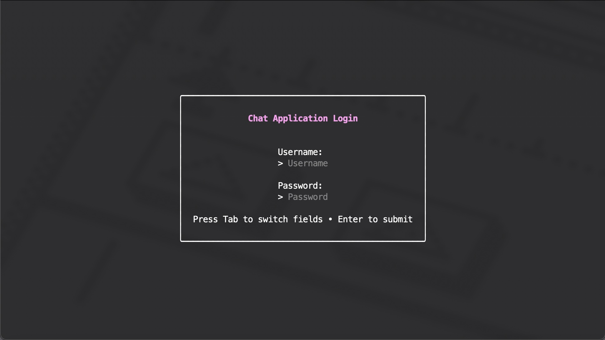
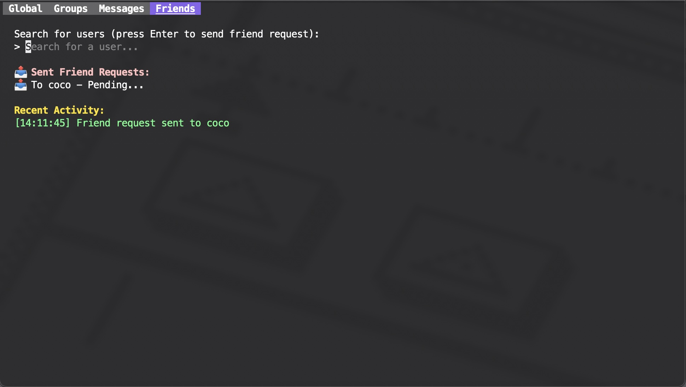
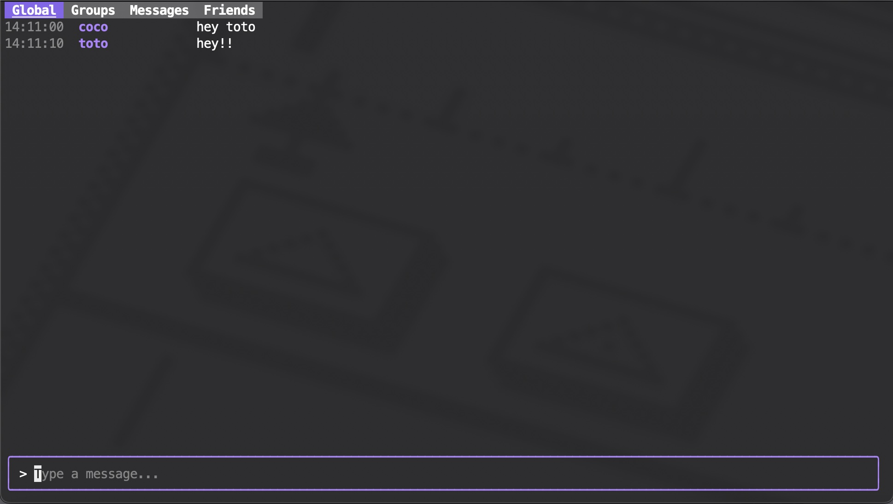

<h1 align="center">Textual</h1>

<p align="center">
  
</p>

<p align="center">
  <strong>Light. Fast. Self-Hosted.</strong>
</p>

---

Textual is a **terminal-based messaging application** built with **Go** that offers a sleek TUI (Text User Interface) experience. Anyone can self-host their own messaging server, enabling distinct communication hubs. Each server provides:

- **Friends List**: Add and manage your connections (in progress).
- **Groups**: Create and participate in group chats (not functional yet).
- **Global Chat**: A unified chatroom for all server members (fully operational).
- **Private Messages**: Chat one-on-one with your friends.

> ⚠️ **Note:** This project is still under development. While the Global Chat tab is fully functional, the Friends tab is under construction, and the Groups feature is not yet implemented.

---

## Features

- **Lightweight**: Runs efficiently in the terminal.
- **Fast**: Powered by Go, with a responsive TUI.
- **Customizable**: Easily host your own messaging server.

---

## Installation

### Prerequisites
- Go 1.22.2 or later
- Docker
- PostgreSQL database

### Clone the Repository
```bash
git clone https://github.com/CorentinMre/Textual.git
cd Textual
```

### Run the Server
Copy the `.env.example` to `.env` and configure your environment variables:
```bash
DB_HOST=
DB_PORT=
DB_USER=
DB_PASSWORD=
DB_NAME=
SERVER_PORT=
JWT_SECRET=
SERVER_HOST=
```


### install dependencies
```bash
go mod tidy
```

### Using Docker
Build and run the application with Docker:
```bash
docker-compose up --build
```

### Run the Client
Start the client:
   ```bash
   go run cmd/client/main.go
   ```


---

## Project Structure

```plaintext
.
├── Dockerfile
├── README.md
├── client.log
├── cmd
│   ├── client
│   │   └── main.go
│   └── server
│       └── main.go
├── docker-compose.yml
├── go.mod
├── go.sum
├── internal
│   ├── client
│   │   ├── models
│   │   ├── network
│   │   └── tui
│   └── server
│       ├── database
│       ├── handlers
│       ├── models
│       └── utils
└── pkg
    └── protocol
```

---

## Technologies Used

- **[Bubble Tea](https://github.com/charmbracelet/bubbletea)**: TUI framework
- **[PostgreSQL](https://www.postgresql.org/)**: Database
- **[Docker](https://www.docker.com/)**: Containerization

---

## Screenshots

<p align="center">
  
  
</p>

<p align="center">
  
</p>

---

## Contributing

Contributions are welcome! Please fork this repository and submit a pull request with your changes. 

---

## License

This project is licensed under the MIT License. See the `LICENSE` file for more details.

---

<p align="center">✨ Built with <3 and Go ✨</p>